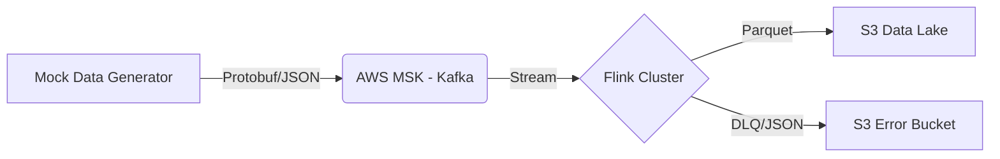

# Ingestion Layer (Kafka + Flink)

This repository serves as the **Real-time Data Ingestion Layer** for the E-Commerce Analytics Platform. It handles high-throughput data generation, ingestion into AWS MSK (Managed Kafka), and stream processing via Flink before landing data into the S3 Data Lake.

## 🏗 Architecture



## 🚀 Key Features

*   **Cloud-Native Architecture**: Fully containerized (Docker) and deployed on **AWS ECS Fargate**.
*   **Infrastructure as Code (IaC)**: All resources managed by Terraform.
*   **Zero-Config Drift**: Configuration is 100% managed by **AWS SSM Parameter Store**. No local config files used in production.
*   **Security First**:
    *   Containers run as non-root users (`USER flink` / `USER python-user`).
    *   **Trust Store Automation**: Automatic AWS Root CA integration.
    *   **IAM Authentication**: Uses SASL/OAUTHBEARER for secure MSK access.
*   **Production Ready**:
    *   **Exactly-Once**: Flink Checkpointing enabled with RocksDB backend.
    *   **Dead Letter Queue (DLQ)**: Robust error handling for malformed data.
    *   **Multi-stage Build**: Optimized Docker images.

## 📂 Repository Structure

```text
ingestion_kafka_flink/
├── flink_jobs/          # Flink Java Application (Core Processing)
│   ├── src/             # Source Code
│   └── pom.xml          # Maven Dependencies
├── mock_data/           # Python Data Simulator (Upstream Source)
├── mykafka/             # Shared Python Kafka Utilities
├── flink_lib/           # External Dependencies (S3/Hadoop Jars)
├── .github/             # CI/CD Pipelines (GitHub Actions)
├── Dockerfile           # Multi-stage Docker Build Definition
├── requirements.txt     # Python Dependencies
└── README.md            # Documentation
```

## 🛠 Development Guide

### Prerequisites

*   Docker Desktop
*   AWS CLI (configured with valid credentials)

### 1. Hybrid Mode (Local Run)

This project supports **Hybrid Development**. You can run the code locally while connecting to AWS Dev infrastructure via SSM.

1.  Configure AWS Credentials:
    ```bash
    aws configure
    ```
2.  Install Dependencies:
    ```bash
    pip install -r requirements.txt
    ```
3.  Run Data Generator:
    ```bash
    # Automatically fetches config from AWS SSM
    python mock_data/user_actions_generator.py
    ```

### 2. Build & Deploy

CI/CD is handled by GitHub Actions.

*   **Build**: Triggers on changes to `flink_jobs/` or `Dockerfile`.
*   **Deploy**: Pushes images to ECR and updates SSM parameters for Terraform.

Manual Build:
```bash
docker build -t flink-ingestion:latest .
```

## 📝 Configuration

Configuration is centrally managed in **AWS SSM Parameter Store**:

*   `/{project}/{env}/kafka/bootstrap_brokers_sasl_iam`
*   `/{project}/{env}/kafka/topic_name`
*   `/{project}/{env}/s3/flink_output_bucket`

## 🤝 Contribution

Follow `git-flow`. All features should be merged into `develop`.