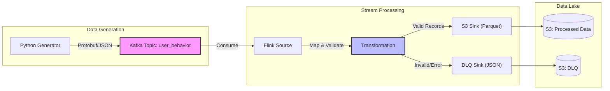

# Real-time Ingestion Pipeline: Kafka & Flink


## 📖 Introduction

This repository hosts the **Real-time Ingestion Layer** for the Data Analytics Platform. It is responsible for generating high-throughput mock user behavior data, buffering it via **Amazon MSK (Managed Kafka)**, and performing stateful stream processing using **Apache Flink** before landing organized Parquet files into the S3 Data Lake.

It is designed to be **Cloud-Native**, running as containerized workloads on **AWS ECS Fargate** with strictly enforced security (IAM Authentication) and reliability (Exactly-Once Semantics).

---

## 🏗️ Repository Ecosystem

This project is part of a larger modularized platform:

| Repository | Role | Tech Stack |
| :--- | :--- | :--- |
| [**`data-platform-infra`**](https://github.com/jiazhi110/data-platform-infra) | **Infrastructure & Orchestration** | Terraform, VPC, ECS, MSK, Step Functions |
| **`ingestion-kafka-flink`** (This Repo) | **Real-time Ingestion Layer** | Java (Flink), Python (Mock Data), Docker |
| [**`top-product-etl`**](https://github.com/jiazhi110/top-product-etl) | **Batch Processing Layer** | Python (Spark), Glue Scripts |

---

## 🏛️ Application Architecture

Unlike the infrastructure repo which focuses on *resources*, this diagram illustrates the **Data Flow** and **Processing Logic**:



---

## ✨ Key Design Decisions

### 1. Robust Stream Processing (Apache Flink)
*   **Exactly-Once Semantics:** Enabled Flink Checkpointing (RocksDB backend) to guarantee data consistency even during node failures.
*   **Parquet on S3:** Data is written using the `Parquet` columnar format with Snappy compression, optimized for downstream analytical queries (Athena/Spark).
*   **Partitioning:** Output is automatically partitioned by `dt` (Date) and `hr` (Hour) to optimize query performance.

### 2. Error Handling (Dead Letter Queue)
*   **Data Quality Firewall:** The Flink job acts as a gatekeeper. Malformed JSON or schema mismatches are captured via `SideOutputs` and routed to a separate **Dead Letter Queue (DLQ)** in S3 (JSON format) for later inspection, preventing pipeline crashes.

### 3. Security & IAM Integration
*   **No Long-lived Credentials:** The Flink application uses **AWS MSK IAM Authentication** (SASL/OAUTHBEARER). It assumes an IAM Role (via ECS Task Role) to authenticate with Kafka, removing the need for secrets management.
*   **Parameter Store Config:** All runtime configurations (Topic names, Brokers, Bucket paths) are fetched dynamically from **AWS SSM Parameter Store** at startup.

### 4. Realistic Data Simulation (Test Data)
*   **Upstream Simulation:** In a real-world scenario, data originates from Frontend/Backend services. Here, the **Python Generator** acts as the entire upstream system, simulating high-concurrency user behavior (Clicks, Purchases, Searches).
*   **Resilience & Negative Testing:** The generator is designed to strictly test the pipeline's resilience. It intentionally injects **"Dirty Data"** (e.g., random nulls, malformed timestamps, missing fields) to verify that the Flink job successfully isolates these records into the **DLQ** without crashing.

### 5. Runtime Environment Variables

The application is fully config-driven via SSM. To enable the dynamic lookup of parameters, the following environment variables **MUST** be provided to the container at runtime:

| Variable | Description | Example Value |
| :--- | :--- | :--- |
| `PROJECT_NAME` | Root prefix for SSM parameter paths | `data-platform` |
| `ENVIRONMENT` | Target environment (matches Terraform) | `dev` |
| `AWS_REGION` | AWS Region for SSM and MSK access | `us-east-1` |

*The system uses these to automatically resolve paths like `/{PROJECT_NAME}/{ENVIRONMENT}/kafka/...`*

---

## 📂 Project Structure

```text
ingestion-kafka-flink/
├── flink_jobs/               # Java: Apache Flink Application
│   ├── src/main/java/...     # Source code (Source, Mapper, Sink)
│   └── pom.xml               # Maven configuration
├── mock_data/                # Python: Data Generator (Faker)
├── flink_lib/                # Dependencies (S3/Hadoop jars for Flink)
├── Dockerfile                # Multi-stage build for Flink
└── .github/workflows/        # CI/CD pipelines
```

---

## 🚀 Getting Started

### Prerequisites
*   Docker Desktop
*   Java 11 (for local Flink dev)
*   Python 3.9+
*   AWS CLI (configured)

### Option 1: Hybrid Development (Recommended)
Run the generator locally, sending data to the **Dev** Kafka cluster in AWS.

1.  **Install Python Deps:**
    ```bash
    pip install -r requirements.txt
    ```
2.  **Run Generator:**
    *(Automatically fetches config from AWS SSM via your local AWS CLI credentials)*
    ```bash
    python mock_data/user_actions_generator.py
    ```

### Option 2: Build & Run Flink Job (Local)
To run the Flink job locally against the remote Kafka (requires VPN/Direct Connect or public Kafka - *Note: Our architecture assumes private MSK, so this step usually requires running inside ECS or a Bastion*).

1.  **Package JAR:**
    ```bash
    cd flink_jobs
    mvn clean package
    ```

### Option 3: Docker Build (Production)
This repository produces **two separate Docker images** managed by independent CI/CD pipelines.

**1. Build Flink Ingestion Job:**
```bash
# Uses the root Dockerfile
# In production/CI, use a specific tag (e.g., Git Commit Hash)
docker build -t flink-ingestion:v1.0.0 .
```

**2. Build Mock Data Generator:**
```bash
# Uses the specific Dockerfile for Python generator
# Context is root (.) to include shared 'mykafka' library
docker build -t mock-data-generator:v1.0.0 -f mock_data/Dockerfile .
```

---

## 🧪 Testing

*   **Unit Tests:** Run JUnit tests for Flink mappers.
    ```bash
    cd flink_jobs
    mvn test
    ```
*   **Generator Tests:**
    ```bash
    pytest mock_data/tests/
    ```
